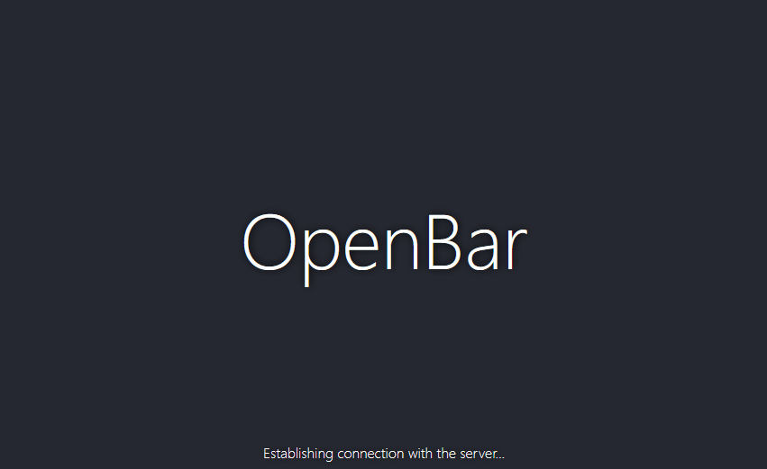

<h1 align="center">OpenBar</h1>


> Somebody once said, if you don't have a page and a pen, just set up a server.

Keep tracks of your drink consumption with your friends. 


<p align="center">
  
</p>


## Getting started

You'll need Golang and Node.js installed on your machine.

```bash
# Install dependencies & build sources for client
cd client/ 
npm install 
npm run build

# Install dependencies & build sources for server
cd ../server/ 
go get ./... 
go build -o app main.go server.go data.go

# Run it !
chmod +x app
./app
```

Grab a beer and go over your [localhost on port 8000](http://localhost:8000).


## Licence 

This software is published under the MIT License.

Built using JavaScript, Svelte.js and Golang.
